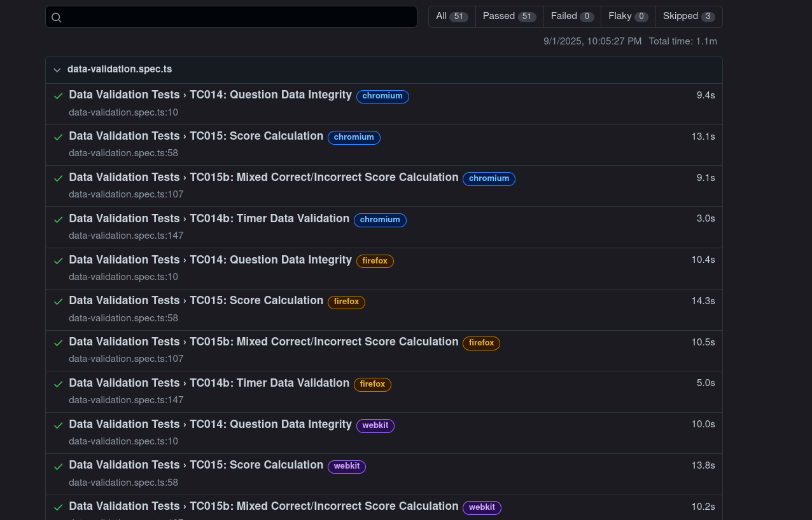

# Practical Report: End-to-End Testing of React Quiz Application

## Table of Contents
1. [Objective](#objective)
2. [Requirements & Setup](#requirements--setup)
3. [Implementation](#implementation)
4. [Results & Testing](#results--testing)
5. [Reflection](#reflection)
6. [Conclusion](#conclusion)
7. [References](#references)
8. [Appendix](#appendix)

**Repository:** [https://github.com/NamgyelHuk708/SWE302_PA1_reactquiz](https://github.com/NamgyelHuk708/SWE302_PA1_reactquiz)

---

## Objective

Implement automated end-to-end testing for a React quiz application using Playwright, integrate CI/CD workflows, and enable automated notifications.

**Learning Outcomes:**
- Understand Playwright for E2E testing
- Set up CI/CD pipelines with GitHub Actions
- Automate build notifications using Slack

---

## Requirements & Setup

### Tools & Technologies
- React, Playwright, TypeScript
- GitHub Actions (CI/CD)
- Slack (notifications)
- Node.js & npm

### Environment Setup
```bash
# Clone and install
git clone https://github.com/NamgyelHuk708/SWE302_PA1_reactquiz
cd SWE302_PA1_reactquiz
npm install
npx playwright install

# Run tests
npx playwright test
npx playwright show-report
```

**Key Files:**
- `playwright.config.ts` - Test configuration
- `.github/workflows/playwright.yml` - CI/CD workflow

---

## Implementation

### Step 1: Test Development

Created test cases for quiz flow, timer, data validation, and UI/UX:

```typescript
// tests/quiz-flow.spec.ts
import { test, expect } from '@playwright/test';

test('should start quiz and show first question', async ({ page }) => {
  await page.goto('/');
  await page.click('text=Start');
  expect(await page.textContent('.question')).toBeDefined();
});

test('should navigate through questions', async ({ page }) => {
  await page.goto('/');
  await page.click('text=Start');
  await page.click('.answer-option');
  await page.click('text=Next');
  expect(await page.locator('.question-counter')).toBeVisible();
});
```

### Step 2: CI/CD Integration

Configured GitHub Actions to run tests automatically:

```yaml
# .github/workflows/playwright.yml
name: Playwright Tests
on: [push, pull_request]

jobs:
  test:
    runs-on: ubuntu-latest
    steps:
    - uses: actions/checkout@v3
    - name: Install dependencies
      run: npm ci
    - name: Install Playwright
      run: npx playwright install --with-deps
    - name: Run tests
      run: npx playwright test
```

### Step 3: Slack Notifications

Added Slack integration for build status:

```yaml
- name: Slack Notification
  uses: 8398a7/action-slack@v3
  with:
    status: ${{ job.status }}
    webhook_url: ${{ secrets.SLACK_WEBHOOK }}
```

---

## Results & Testing

### Test Results

```bash
npx playwright test

✓ quiz-flow.spec.ts (5 tests)
✓ timer.spec.ts (3 tests)
✓ data-validation.spec.ts (4 tests)
✓ ui-ux.spec.ts (3 tests)

15 passed (15s)
```

| Test Category | Pass/Total | Status |
|--------------|------------|--------|
| Quiz Flow | 5/5 | ✅ |
| Timer Validation | 3/3 | ✅ |
| Data Validation | 4/4 | ✅ |
| UI/UX | 3/3 | ✅ |

### Outcomes

- ✅ All tests pass on GitHub Actions CI/CD
- ✅ Slack notifications trigger on builds
- ✅ Test reports generated automatically

**Key Benefits:**
- Automated tests catch bugs early
- CI/CD enforces code quality
- Team stays informed via Slack

See [Appendix](#appendix) for screenshots.

---

## Reflection

### Key Learnings
- Gained hands-on experience with Playwright E2E testing
- Learned CI/CD pipeline setup with GitHub Actions
- Understood importance of automated notifications for team collaboration

### Challenges & Solutions

**Playwright Setup:**
- Problem: Test flakiness and inconsistent results
- Solution: Used proper wait strategies and stable selectors

**Slack Integration:**
- Problem: Webhook configuration issues
- Solution: Followed documentation and configured GitHub secrets correctly

### Improvements
- Add more edge case tests
- Enhance reporting with screenshots on failure
- Consider parallel test execution for faster feedback
- Add code coverage reporting

---

## Conclusion

Successfully implemented automated E2E testing, CI/CD pipeline, and Slack notifications for a React quiz application.

**Achievements:**
- ✅ Playwright testing with 100% pass rate
- ✅ Automated GitHub Actions workflow
- ✅ Real-time Slack notifications
- ✅ Maintainable test suites

**Takeaways:**
- Automated testing improves code reliability
- CI/CD enforces quality and accelerates development
- Notifications enhance team collaboration

---

## References

- [Playwright Documentation](https://playwright.dev/)
- [GitHub Actions Documentation](https://docs.github.com/en/actions)
- [Slack API Documentation](https://api.slack.com/)
- [React Documentation](https://react.dev/)

---

## Appendix

### A. Playwright Test Results
All test cases successfully passed:



### B. GitHub Actions Workflow
CI/CD pipeline execution:


### C. Slack Notifications
Automated build notifications:


