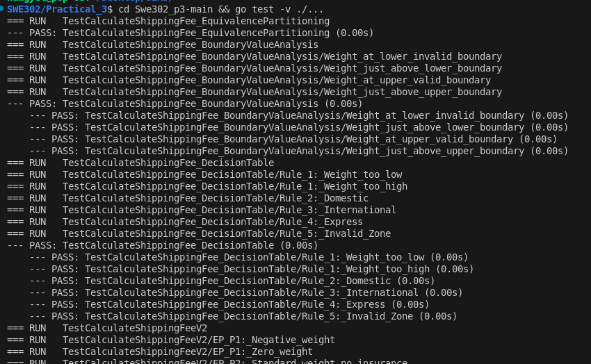

# Practical Report: Specification-Based Testing

## Objective

Implement and test the `CalculateShippingFee` function (v2) using specification-based testing techniques.

**Learning Outcomes:**
- Apply Equivalence Partitioning to identify test cases
- Use Boundary Value Analysis for edge case testing
- Validate business rules through systematic testing

**Repository:** https://github.com/NamgyelHuk708/SWE302_PA3

## Requirements & Setup

**Tools & Technologies:**
- Go (Golang)
- Go testing framework

**Environment Setup:**
```bash
# Clone the repository
cd SWE302_PA3

# Run tests
go test -v
```

**Configuration Files:**
- `go.mod`, `go.sum` - Dependency management
- `shipping_v2_test.go` - Test cases

## Implementation

**Equivalence Partitioning Analysis:**

Identified partitions for each input parameter to minimize redundant tests while ensuring coverage.

**Weight (`float64`) Partitions:**
- **Invalid (≤ 0):** Weight must be strictly positive
- **Standard Tier (0 < Weight ≤ 10):** Base fee only
- **Heavy Tier (10 < Weight ≤ 50):** Base fee + $7.50 surcharge
- **Invalid (> 50):** Exceeds maximum allowed weight

**Zone (`string`) Partitions:**
- **Valid Zones:** `"Domestic"` ($5), `"International"` ($20), `"Express"` ($30)
- **Invalid Zones:** Any non-matching string (case-sensitive)

**Insured (`bool`) Partitions:**
- **Insured (`true`):** Adds 1.5% insurance fee on subtotal
- **Not Insured (`false`):** No additional fee

**Boundary Value Analysis:**

Selected boundary values to test edge cases where off-by-one errors are likely.

**Weight Boundaries:**
- **At 0:** `0` (Invalid), `0.1` (Valid) - Verifies positive weight requirement
- **At 10:** `10` (Standard), `10.1` (Heavy) - Verifies tier threshold
- **At 50:** `50` (Valid), `50.1` (Invalid) - Verifies maximum weight limit

## Results & Testing

All test cases passed, validating correct implementation of business rules.

**Test Output:**

All partitions and boundaries tested successfully.

**Explanation:**

Test suite covers all identified equivalence partitions and boundary values, confirming the function correctly handles valid inputs, edge cases, and invalid inputs per specification.

## Reflection

**Key Learnings:**
- Systematic application of Equivalence Partitioning reduces test redundancy
- Boundary Value Analysis effectively catches off-by-one errors
- Specification-based testing ensures alignment with business rules

**Challenges:**
- Identifying all relevant partitions comprehensively
- Determining critical boundary values

**Possible Improvements:**
- Add more zone variations for robustness
- Test with floating-point edge cases

## Conclusion

Successfully implemented specification-based testing for the shipping fee calculator using Equivalence Partitioning and Boundary Value Analysis, achieving comprehensive test coverage.

## Appendix

**Test Execution Results:**




