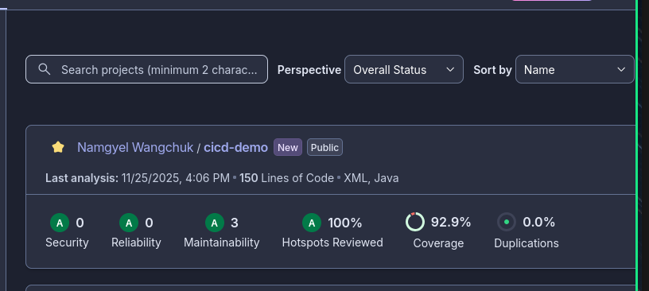

# Practical Report: SonarCloud SAST Integration

## Objective

Integrate SonarCloud Static Application Security Testing (SAST) into CI/CD pipeline for automated security analysis and code quality monitoring.

**Learning Outcomes:**
- Implement SAST with SonarCloud in GitHub Actions
- Automate security vulnerability detection
- Configure quality gates and code coverage reporting
- Analyze and interpret security scan results

**Repository:** https://github.com/NamgyelHuk708/SWE302_PA4b

## Requirements & Setup

**Tools & Technologies:**
- Application: Spring Boot 3.1.2 (Java 17)
- Build Tool: Maven 3.x
- CI/CD: GitHub Actions
- SAST: SonarCloud
- Coverage: JaCoCo

**Environment Setup:**
```bash
# Clone repository
cd SWE302_PA4b

# Build with coverage
mvn clean verify

# Run SonarCloud analysis
mvn sonar:sonar -Dsonar.token=$SONAR_TOKEN
```

**Configuration Files:**
- `sonar-project.properties` - SonarCloud configuration
- `.github/workflows/sonarcloud.yml` - CI/CD workflow
- `pom.xml` - Maven plugins (SonarCloud, JaCoCo)

## Implementation

**SonarCloud Configuration:**

Created `sonar-project.properties` with analysis parameters:

```properties
sonar.organization=namgyelhuk708
sonar.projectName=CICD Demo
sonar.sources=src/main/java
sonar.tests=src/test/java
sonar.java.source=17
sonar.java.binaries=target/classes
sonar.coverage.jacoco.xmlReportPaths=target/site/jacoco/jacoco.xml
sonar.exclusions=**/*Test.java,**/test/**
```

**Maven Plugin Integration:**

Added SonarCloud and JaCoCo plugins to `pom.xml`:

```xml
<plugin>
    <groupId>org.sonarsource.scanner.maven</groupId>
    <artifactId>sonar-maven-plugin</artifactId>
    <version>4.0.0.4121</version>
</plugin>

<plugin>
    <groupId>org.jacoco</groupId>
    <artifactId>jacoco-maven-plugin</artifactId>
    <version>0.8.11</version>
</plugin>
```

**GitHub Actions Workflow:**

Automated pipeline (`.github/workflows/sonarcloud.yml`):

**Triggers:**
- Push to `main` branch
- Pull request events

**Steps:**
1. Checkout code with full git history
2. Setup JDK 17 with Maven caching
3. Build and test with JaCoCo coverage
4. Execute SonarCloud analysis
5. Publish results to dashboard

**Security Configuration:**

GitHub Secrets configured:
- `SONAR_TOKEN` - SonarCloud API authentication
- `SONAR_ORGANIZATION` - Organization ID: `namgyelhuk708`

**Quality Gate Setup:**

Default quality gate conditions:
- Coverage ≥ 80%
- Duplicated Lines < 3%
- Maintainability/Reliability/Security Rating = A
- Security Hotspots Reviewed = 100%

## Results & Testing

SonarCloud analysis executed successfully with automated security scanning and quality reporting.

**GitHub Actions Workflow:**


**SonarCloud Dashboard:**



**Explanation:**

Every code commit triggers automated SonarCloud analysis covering security vulnerabilities, code quality issues, test coverage, and technical debt. Results are displayed in the SonarCloud dashboard with quality gate status, providing immediate feedback on code health and security posture.

## Reflection

**Key Learnings:**
- SonarCloud integration provides comprehensive security and quality analysis
- Automated SAST in CI/CD enables early vulnerability detection
- Quality gates enforce code standards before deployment
- JaCoCo integration enables coverage tracking

**Challenges:**
- **Quality Gate Configuration:** Balanced strict enforcement with learning objectives by allowing analysis completion for review
- **Organization Migration:** Updated configuration files with correct organization identifier

**Possible Improvements:**
- Increase test coverage to meet 80% threshold
- Define custom quality gates for project-specific standards
- Enable branch protection requiring SonarCloud checks
- Add scheduled weekly deep scans
- Integrate additional SAST/DAST tools (Snyk, OWASP ZAP)

## Conclusion

Successfully integrated SonarCloud SAST into CI/CD pipeline, enabling automated security vulnerability detection, code quality monitoring, and continuous analysis on every commit.

## References

- [SonarCloud Documentation](https://docs.sonarcloud.io/)
- [GitHub Actions Documentation](https://docs.github.com/en/actions)
- [Maven SonarCloud Plugin](https://docs.sonarcloud.io/advanced-setup/ci-based-analysis/sonarscanner-for-maven/)
- [JaCoCo Documentation](https://www.jacoco.org/jacoco/)

## Appendix

**Project Structure:**
```
SWE302_PA4b/
├── src/main/java/ - Application source code
├── src/test/java/ - Unit tests
├── .github/workflows/sonarcloud.yml - CI/CD pipeline
├── sonar-project.properties - SonarCloud config
└── pom.xml - Maven configuration with plugins
```

**Best Practices Implemented:**
- Secret management via GitHub Secrets
- Maven and SonarCloud package caching
- Full git history for accurate analysis
- Test file exclusion from production analysis
- PR decoration for developer feedback
