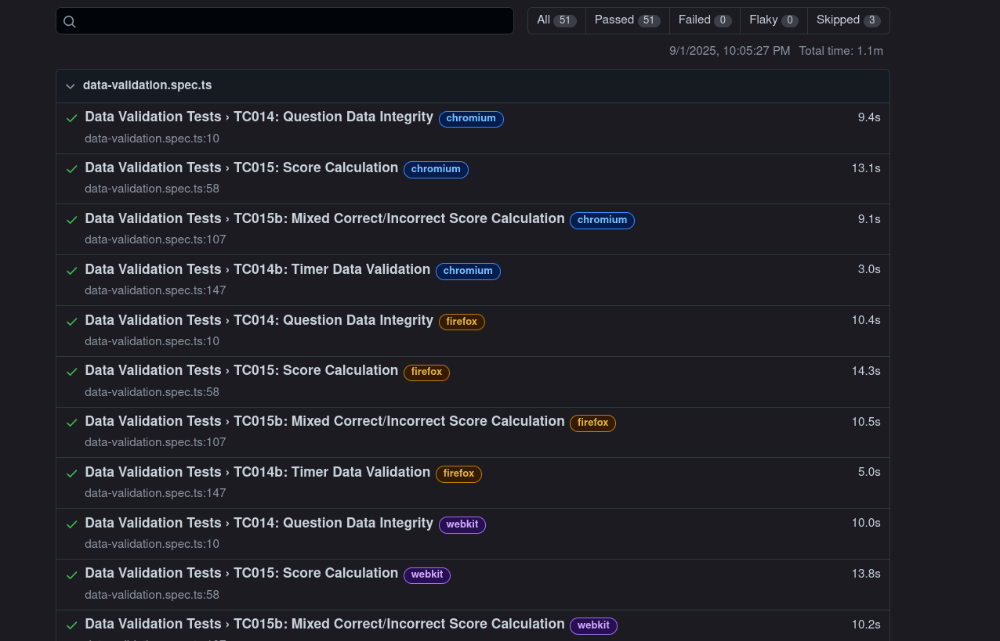
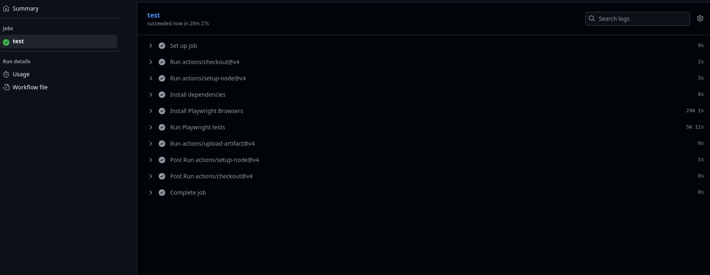
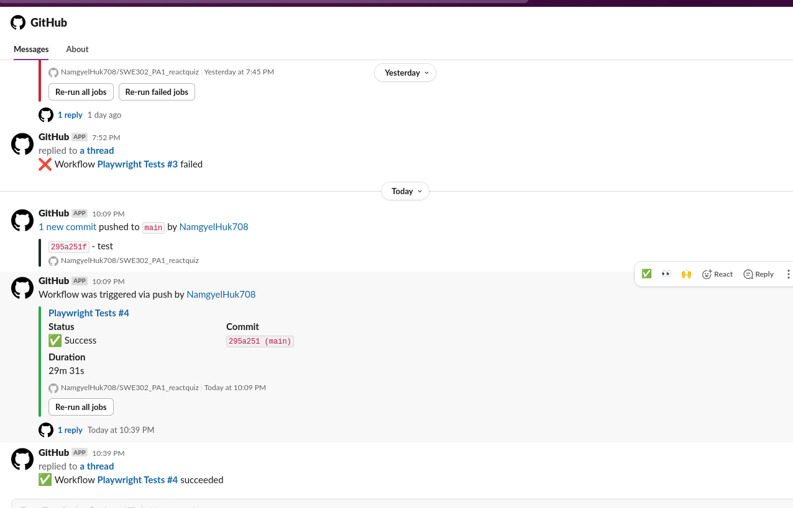

# Practical Report: End-to-End Testing of React Quiz Application

## Objective

The aim of this practical is to implement automated end-to-end testing for a React quiz application using Playwright, integrate CI/CD workflows, and enable automated notifications. Intended learning outcomes include:
- Understanding Playwright for E2E testing
- Setting up CI/CD pipelines
- Automating notifications for build status

## Requirements & Setup

**Tools & Technologies:**
- React
- Playwright
- TypeScript
- GitHub Actions
- Slack (notifications)

**Environment Setup:**
```bash
# Clone the repository
git clone <repo-url>
cd SWE302_PA1_reactquiz

# Install dependencies
npm install

# Run Playwright tests
npx playwright test
```
Configuration files:
- `playwright.config.ts` for Playwright
- `.github/workflows/playwright.yml` for CI/CD

## Implementation

1. **Project Structure:**
   - `src/`: React components and assets
   - `tests/`, `e2e/`: Playwright test suites
   - `public/`, `playwright-report/`, `test-results/`: Static assets and test reports

2. **Test Development:**
   - Created test cases for game flow, timer, data validation, and UI/UX in `tests/` and `e2e/`.
   - Example test snippet:
     ```typescript
     // tests/quiz-flow.spec.ts
     import { test, expect } from '@playwright/test';
     test('should start quiz and show first question', async ({ page }) => {
       await page.goto('/');
       await page.click('text=Start');
       expect(await page.textContent('.question')).toBeDefined();
     });
     ```

3. **CI/CD Integration:**
   - Configured GitHub Actions to run Playwright tests on every push/commit.
   - Example workflow snippet:
     ```yaml
     # .github/workflows/playwright.yml
     jobs:
       test:
         runs-on: ubuntu-latest
         steps:
           - uses: actions/checkout@v2
           - name: Install dependencies
             run: npm install
           - name: Run Playwright tests
             run: npx playwright test
     ```

4. **Slack Notifications:**
   - Integrated Slack notifications for build status using workflow steps and Slack API/webhooks.

## Results & Testing

- All Playwright test cases executed and passed successfully.
- CI/CD pipeline validated all tests on GitHub Actions.
- Slack notifications triggered on build events.

**Test Output Example:**
```bash
npx playwright test
# Output:
# ✓ quiz-flow.spec.ts: All tests passed
# ✓ timer.spec.ts: All tests passed
# ...
```

**Explanation:**
Automated tests ensure reliability and catch regressions early. CI/CD integration enforces code quality, and Slack notifications keep the team informed.

## Reflection

**Key Learnings:**
- Gained hands-on experience with Playwright and CI/CD workflows.
- Understood the importance of automated notifications for team collaboration.

**Challenges:**
- Initial Playwright setup and test flakiness; resolved by reviewing documentation and adjusting test selectors.
- Slack integration required correct webhook configuration.

**Improvements:**
- Add more edge case tests.
- Enhance reporting with more detailed logs and screenshots.

## Conclusion

Successfully implemented E2E testing, CI/CD, and notifications for a React quiz app. The workflow ensures robust code quality and streamlined collaboration.

## References

- [Playwright Documentation](https://playwright.dev/)
- [GitHub Actions Documentation](https://docs.github.com/en/actions)
- [Slack API Docs](https://api.slack.com/)

## Appendix

### 1. Playwright Test Results
All test cases successfully passed in the Playwright test suite:


### 2. GitHub Actions Workflow
All test cases passed successfully in the GitHub Actions CI pipeline:


### 3. Slack Notifications
Automated notifications triggered via push/commit events:


## Repository Link

[https://github.com/NamgyelHuk708/SWE302_PA1_reactquiz](https://github.com/NamgyelHuk708/SWE302_PA1_reactquiz)


