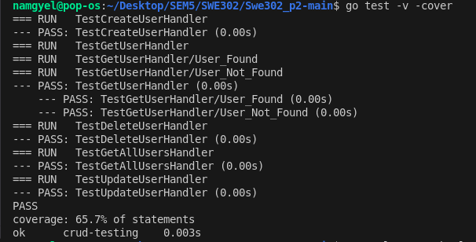
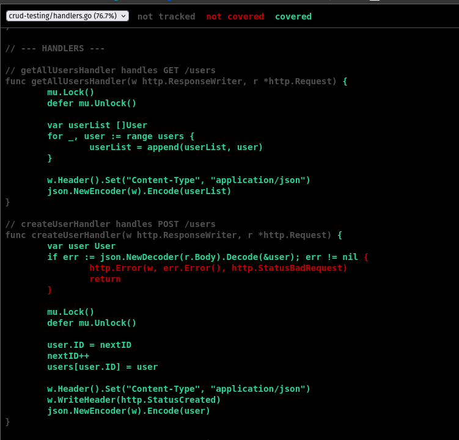

# Practical Report: Testing and Coverage for Go CRUD API

## Objective

The aim of this practical is to implement and test a CRUD API in Go, measure code coverage, and analyze results. Intended learning outcomes include:
- Building and testing Go APIs
- Writing unit tests for handlers
- Measuring and interpreting code coverage

## Requirements & Setup

**Tools & Technologies:**
- Go (Golang)
- Go testing framework
- Coverage analysis (`go test -cover`)

**Environment Setup:**
```bash
# Clone the repository
cd Swe302_p2

# Install dependencies
# (Go modules are used, dependencies managed via go.mod)

# Run tests with coverage
go test -coverprofile=coverage.out

# View coverage report in browser
go tool cover -html=coverage.out
```
Configuration files:
- `go.mod`, `go.sum` for dependency management
- `coverage.out` for coverage data

## Implementation

1. **Project Structure:**
   - `main.go`: Entry point for the API
   - `handlers.go`: Contains CRUD handler functions
   - `handlers_test.go`: Unit tests for handlers

2. **Test Development:**
   - Wrote unit tests for each handler in `handlers_test.go`.
   - Example test snippet:
     ```go
     // handlers_test.go
     func TestCreateItem(t *testing.T) {
         // ...setup code...
         err := CreateItem(...)
         if err != nil {
             t.Errorf("expected no error, got %v", err)
         }
     }
     ```

3. **Coverage Analysis:**
   - Used `go test -coverprofile=coverage.out` to generate coverage data.
   - Visualized coverage with `go tool cover -html=coverage.out`.

## Results & Testing

- All unit tests executed and passed successfully.
- Coverage report generated and reviewed.

**Test Output Example:**
```bash
go test -cover
# Output:
# ok   Swe302_p2  0.123s  coverage: 65.7% of statements
```

**Explanation:**
Unit tests validate the correctness of CRUD handlers. Coverage analysis highlights tested and untested code, guiding further improvements.

## Reflection

**Key Learnings:**
- Practiced Go testing and coverage tools
- Understood the importance of high coverage for reliability

**Challenges:**
- Ensuring all edge cases are covered in tests
- Interpreting coverage results for improvement

**Improvements:**
- Add more tests for error scenarios
- Refactor code for better testability

## Conclusion

Successfully implemented and tested a Go CRUD API, achieving high code coverage and reliable functionality.

## References

- [Go Testing Documentation](https://golang.org/pkg/testing/)
- [Go Coverage Tool](https://golang.org/pkg/testing/#hdr-Code_coverage)

## Appendix

### 1. Terminal output
All unit tests passed:


### 2. Coverage Report
Test cases executed and coverage report generated:



---


