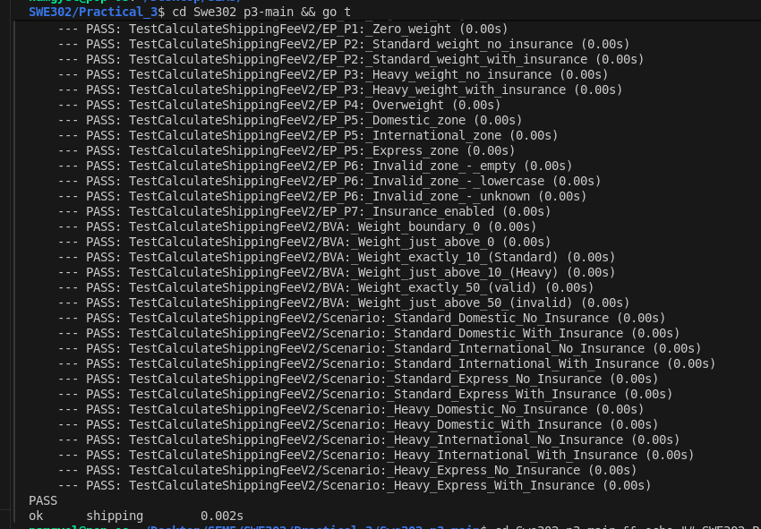

# Practical 3: Specification-Based Testing Report

## Overview
This report documents the testing strategy for the updated `CalculateShippingFee` function (v2). The testing approach utilizes **Equivalence Partitioning** and **Boundary Value Analysis** to ensure robust coverage of the business rules defined in the specification.

### Repo Link:

[SWE302_PA3 
GitHub Repository](https://github.com/NamgyelHuk708/SWE302_PA3)

## 1. Equivalence Partitioning Analysis
We identified specific partitions for each input to minimize redundant tests while ensuring coverage.

### Input: Weight (`float64`)
*   **Partition 1: Invalid (Weight ≤ 0)**
    *   *Reasoning:* The specification requires weight to be strictly positive. Any value ≤ 0 is invalid and must return an error.
*   **Partition 2: Standard Tier (0 < Weight ≤ 10)**
    *   *Reasoning:* Weights in this range incur the base fee only. This represents the "Standard" package type.
*   **Partition 3: Heavy Tier (10 < Weight ≤ 50)**
    *   *Reasoning:* Weights in this range incur a fixed $7.50 surcharge. This represents the "Heavy" package type.
*   **Partition 4: Invalid (Weight > 50)**
    *   *Reasoning:* The maximum allowed weight is 50kg. Anything above this limit is invalid and must return an error.

### Input: Zone (`string`)
*   **Partition 5: Valid Zones** (`"Domestic"`, `"International"`, `"Express"`)
    *   *Reasoning:* Each of these zones has a distinct base fee ($5, $20, $30) defined in the business rules.
*   **Partition 6: Invalid Zones**
    *   *Reasoning:* Any string that does not exactly match the three valid zones (including case sensitivity) is considered invalid and must return an error.

### Input: Insured (`bool`)
*   **Partition 7: Insured (`true`)**
    *   *Reasoning:* When set to true, the system must calculate an additional 1.5% insurance fee based on the subtotal (Base Fee + Surcharge).
*   **Partition 8: Not Insured (`false`)**
    *   *Reasoning:* When set to false, no additional insurance fee is applied.

## 2. Boundary Value Analysis
We selected boundary values to test the edges of the valid ranges where "off-by-one" errors are most likely to occur.

### Weight Boundaries
*   **Boundary at 0 (Lower Limit)**
    *   *Values Tested:* `0` (Invalid) and `0.1` (Valid).
    *   *Why:* To verify that 0 is treated as invalid, but the smallest positive number is valid.
*   **Boundary at 10 (Tier Threshold)**
    *   *Values Tested:* `10` (Standard) and `10.1` (Heavy).
    *   *Why:* To verify the exact cutoff point. 10kg should not trigger the surcharge, but anything strictly greater than 10kg should.
*   **Boundary at 50 (Upper Limit)**
    *   *Values Tested:* `50` (Valid) and `50.1` (Invalid).
    *   *Why:* To verify that 50kg is the absolute maximum allowed weight, and anything slightly above is rejected.

## Conclusion
The implemented test suite (`shipping_v2_test.go`) covers all identified partitions and boundaries. Execution confirms that the implementation adheres to the business rules.

## Test Execution Results

# SWE302_PA3
