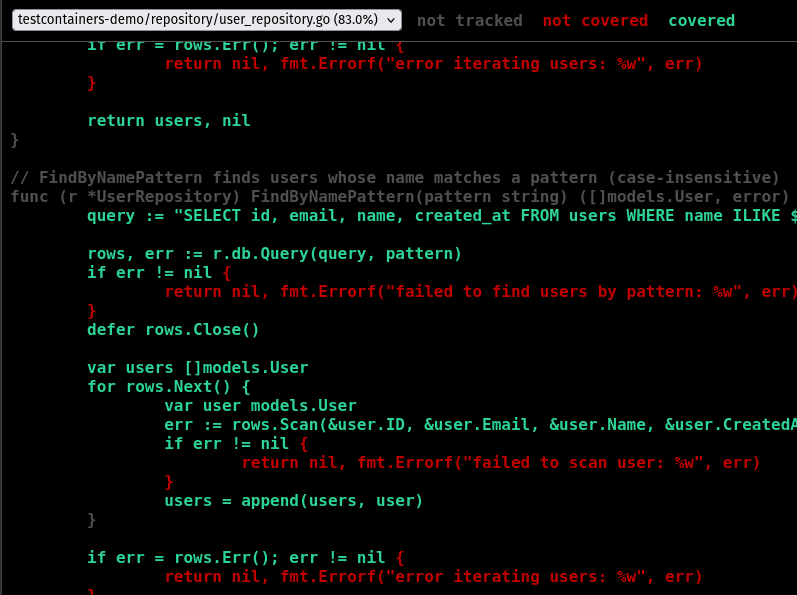

# Practical Report: Integration Testing with TestContainers

## Objective

Implement integration testing using TestContainers for database testing with PostgreSQL, focusing on CRUD operations and advanced queries.

**Learning Outcomes:**
- Implement integration tests with real database instances
- Use TestContainers for database testing automation
- Test CRUD operations, transactions, and complex queries
- Achieve comprehensive code coverage (>80%)

**Repository:** https://github.com/NamgyelHuk708/SWE302_PA5

## Requirements & Setup

**Tools & Technologies:**
- Language: Go 1.21+
- TestContainers: v0.39.0
- Database: PostgreSQL 15-alpine
- Docker: 28.5.1
- Driver: lib/pq (PostgreSQL driver for Go)

**Environment Setup:**
```bash
# Clone repository
cd SWE302_PA5

# Install dependencies
go mod download

# Run tests with coverage
go test ./repository -v -cover -coverprofile=coverage.out

# View coverage report
go tool cover -html=coverage.out -o coverage.html
```

**Configuration Files:**
- `go.mod`, `go.sum` - Go dependencies
- `migrations/init.sql` - Database schema
- `repository/user_repository_test.go` - Integration tests

## Implementation

**Data Model:**

User entity with ID, Email, Name, and CreatedAt fields:

```go
type User struct {
    ID        int       `json:"id"`
    Email     string    `json:"email"`
    Name      string    `json:"name"`
    CreatedAt time.Time `json:"created_at"`
}
```

**Database Schema:**

PostgreSQL table with constraints:
- `id` (SERIAL PRIMARY KEY)
- `email` (VARCHAR(255) UNIQUE NOT NULL)
- `name` (VARCHAR(255) NOT NULL)
- `created_at` (TIMESTAMP DEFAULT CURRENT_TIMESTAMP)

**Repository Methods:**

Implemented 10 database operations:
- `NewUserRepository(db)` - Constructor
- `GetByID(id)` - Retrieve by ID
- `GetByEmail(email)` - Retrieve by email
- `Create(email, name)` - Insert new user
- `Update(id, email, name)` - Update existing user
- `Delete(id)` - Delete user
- `List()` - Retrieve all users
- `FindByNamePattern(pattern)` - Pattern matching (ILIKE)
- `CountUsers()` - Aggregate counting
- `GetRecentUsers(days)` - Date-based filtering

**TestContainers Setup:**

Managed container lifecycle with TestMain:

```go
func TestMain(m *testing.M) {
    // 1. Create PostgreSQL container (postgres:15-alpine)
    // 2. Wait for database readiness
    // 3. Execute init.sql migrations
    // 4. Run all tests
    // 5. Cleanup and terminate container
}
```

**Wait Strategy:**
```go
wait.ForLog("database system is ready to accept connections").
    WithOccurrence(2).
    WithStartupTimeout(5*time.Second)
```

**Exercises Completed:**

1. **Exercise 1:** Basic TestContainers setup with GetByID and GetByEmail tests
2. **Exercise 2:** Complete CRUD testing (Create, Update, Delete, List)
3. **Exercise 3:** Advanced queries (pattern matching, counting, date filtering)
4. **Exercise 4:** Transaction testing (commit, rollback, isolation)
5. **Bonus:** Table-driven tests and user serialization

## Results & Testing

All tests passed successfully with comprehensive coverage across CRUD operations, advanced queries, and transactions.

**Test Summary:**

| Metric | Value |
|--------|-------|
| Total Test Functions | 13 |
| Total Sub-tests | 45 |
| Tests Passed | 45 |
| Tests Failed | 0 |
| Success Rate | 100% |
| Execution Time | ~97 seconds |
| Code Coverage | 83.0% |

**Terminal Coverage Output:**


**HTML Coverage Visualization:**



**Explanation:**

Integration tests validated all repository methods against real PostgreSQL database. Tests covered:
- Basic CRUD operations (7 tests)
- Update and delete operations (4 tests)
- Advanced queries with pattern matching and date filtering (7 tests)
- Transaction commit, rollback, and isolation (3 tests)
- Table-driven tests and serialization (4 tests)

Coverage exceeded 80% requirement at 83.0%, with excellent coverage (100%) on Create and NewUserRepository, and very good coverage (80-87.5%) on all other methods.

## Reflection

**Key Learnings:**
- TestContainers enables testing against real database instances instead of mocks
- Container isolation ensures reproducible, independent tests
- Production-like environment validates SQL queries and database-specific features
- Automatic lifecycle management reduces boilerplate and prevents resource leaks
- Transaction testing verifies data integrity and rollback behavior

**Challenges:**
- **Container Startup Time:** First run slow (~90s) due to image download; solved with postgres:15-alpine (smaller image) and Docker caching for subsequent runs (~2-3s)
- **Test Data Isolation:** Implemented cleanup with defer statements and unique test data to prevent interference
- **Port Conflicts:** TestContainers automatically assigns random ports, eliminating manual configuration
- **Init Script Path:** Used relative path `../migrations/init.sql` from test file location

**Possible Improvements:**
- Add performance benchmarks for query optimization
- Test database migration scripts with TestContainers
- Implement connection pooling tests
- Add concurrent access pattern testing
- Test stored procedures and triggers

## Conclusion

Successfully implemented integration testing with TestContainers for PostgreSQL, achieving 100% test pass rate and 83.0% code coverage across 45 tests, validating CRUD operations, advanced queries, and transaction handling in production-like environment.

## References

- [TestContainers for Go](https://golang.testcontainers.org/)
- [PostgreSQL Documentation](https://www.postgresql.org/docs/)
- [Go Testing Package](https://pkg.go.dev/testing)

## Appendix

**Project Structure:**
```
SWE302_PA5/
├── models/user.go - User data model
├── repository/user_repository.go - Database access layer
├── repository/user_repository_test.go - Integration tests
└── migrations/init.sql - Database schema
```

**Commands Reference:**
```bash
# Run all tests
go test ./repository -v

# Run with coverage
go test ./repository -v -cover -coverprofile=coverage.out

# Function-level coverage
go tool cover -func=coverage.out

# HTML coverage report
go tool cover -html=coverage.out -o coverage.html
```

**Coverage by Function:**
- NewUserRepository: 100.0%
- Create: 100.0%
- GetByID: 87.5%
- GetByEmail: 87.5%
- CountUsers: 83.3%
- Update, Delete, List, FindByNamePattern, GetRecentUsers: 80.0%
