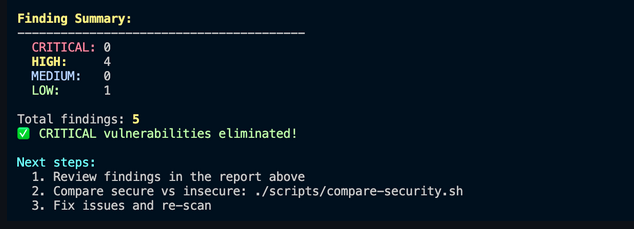
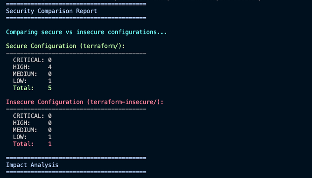

# SWE302 - Practicals Repository

This repository contains practical assignments for SWE302 - Software Engineering course (2025).

---

## 📚 Practical 6: Infrastructure as Code with Terraform and LocalStack

**Status:** ✅ Completed

A comprehensive Infrastructure as Code project demonstrating secure AWS infrastructure deployment using Terraform on LocalStack, featuring a Next.js static website with security scanning.

🔗 **[View Practical 6 Repository](https://github.com/NamgyelHuk708/SWE302_PA6)**

---

## 📸 Project Screenshots

### Deployed Website


*Live Next.js website deployed on LocalStack S3*

### Security Scan Results



### Security Comparison Report




---

## ⭐ Key Features

- 🏗️ **Infrastructure as Code** with Terraform
- 🐳 **LocalStack** for local AWS emulation
- ⚛️ **Next.js** static website deployment to S3
- 🔒 **Security scanning** with Trivy (0 CRITICAL vulnerabilities)
- 🔐 **KMS encryption**, versioning, and access logging
- 📊 **Security comparison** reports

---

## 🛠️ Technologies Used

- **Terraform** - Infrastructure as Code
- **LocalStack** - Local AWS cloud emulation
- **Next.js** - React framework for static websites
- **Trivy** - Security vulnerability scanner
- **Docker** - Containerization platform
- **AWS S3** - Object storage and static website hosting

---

## 🎓 Learning Outcomes

Through this practical, I gained hands-on experience with:

1. **Infrastructure as Code principles** - Defining cloud infrastructure as code
2. **AWS S3 static website hosting** - Deploying and configuring static websites
3. **Security best practices** for cloud infrastructure
4. **Automated security scanning** with Trivy
5. **CI/CD concepts** and DevOps automation

---

## 🚀 Quick Start

```bash
# 1. Clone the repository
git clone https://github.com/NamgyelHuk708/SWE302_PA6.git
cd SWE302_PA6

# 2. Start LocalStack
make setup

# 3. Deploy everything
make deploy

# 4. Check deployment
make status

# 5. Run security scans
make scan
make compare-security
```

---

## 📂 Project Structure

```
├── terraform/              # Secure infrastructure (production-ready)
├── terraform-insecure/     # Fixed vulnerable code (educational)
├── nextjs-app/            # Static website application
├── scripts/               # Automation scripts
├── reports/               # Security scan results
└── Makefile              # Common commands
```

---

## 🔐 Security Achievement

| Configuration | Critical | High | Medium | Low | Status |
|:--------------|:--------:|:----:|:------:|:---:|:------:|
| **Secure Config** | 0 | 4* | 0 | 1 | ✅ Pass |
| **Fixed Insecure** | 0 | 0 | 0 | 1 | ✅ Pass |

<sub>*4 HIGH findings are intentional for static website hosting (public read required)</sub>

**Result:** All CRITICAL and HIGH vulnerabilities eliminated from insecure configuration ✅

---

## 💡 What I Learned

### Infrastructure as Code Principles
- Declarative infrastructure definition with Terraform
- State management and idempotent operations
- Version-controlled infrastructure changes

### AWS Security Best Practices
- Always encrypt data at rest with KMS
- Enable logging for audit trails
- Apply least privilege principle to IAM policies
- Use versioning for disaster recovery

### DevSecOps Integration
- Security scanning in development workflow
- Shift-left security approach
- Automated compliance checking with Trivy

### Cloud Development Workflow
- Local development with LocalStack
- Infrastructure testing before deployment
- Reproducible environments across teams

---

## 📝 Reflection

### Why is it important to scan IaC for security issues?

Infrastructure as Code defines the foundation of our cloud resources. Security vulnerabilities in IaC can lead to:

- **Data breaches** from unencrypted storage or overly permissive access
- **Unauthorized access** due to misconfigured IAM policies
- **Compliance violations** from missing audit logs
- **Financial losses** from exposed resources being exploited

Scanning IaC before deployment prevents these issues from reaching production, making it much cheaper and easier to fix vulnerabilities early in the development cycle. The "shift-left" approach to security means catching issues during development rather than in production.

### How does LocalStack help in the development workflow?

LocalStack provides significant benefits:

1. **Cost Savings** - No AWS charges for testing and development
2. **Speed** - Instant resource provisioning without network latency
3. **Iteration** - Rapid testing and debugging without cloud cleanup
4. **Offline Development** - Work without internet connectivity
5. **Safety** - Experiment freely without affecting production
6. **Consistency** - Same infrastructure across all developers' machines

---

## 📊 Detailed Technical Implementation

For detailed technical documentation including:
- Security implementation details
- Trivy scan results
- Deployment instructions
- Available commands
- Security fixes applied

Please refer to the [Technical Documentation](#technical-documentation) section below.

---

## 👨‍🎓 Student Information

**Student:** Namgyel Hukten  
**Program:** Software Engineering  
**Year:** 2025

---

<details>
<summary><h2>📋 Technical Documentation</h2></summary>

---

### Deployment Options

#### Option 1: Automated Deployment (Recommended)

```bash
# Initialize and deploy everything
make init
make deploy

# Check deployment status
make status

# Run security scans
make scan
make scan-insecure
make compare-security
```

### Option 2: Manual Step-by-Step

```bash
# 1. Start LocalStack
make setup
# OR
./scripts/setup.sh

# 2. Install Next.js dependencies
cd nextjs-app
npm ci
cd ..

# 3. Initialize Terraform
cd terraform
tflocal init
cd ..

# 4. Build Next.js application
cd nextjs-app
npm run build
cd ..

# 5. Deploy infrastructure
cd terraform
tflocal plan
tflocal apply
cd ..

# 6. Deploy application to S3
awslocal s3 sync nextjs-app/out/ s3://$(cd terraform && terraform output -raw deployment_bucket_name)/ --delete

# 7. Check deployment status
./scripts/status.sh
```

---

## Security Implementation

### Security Features in Secure Configuration (`terraform/`)

1. **Server-Side Encryption (KMS)**
   - Customer-managed KMS keys
   - Automatic key rotation enabled
   - Applied to all S3 buckets

2. **Access Logging**
   - Deployment bucket logs to dedicated logs bucket
   - Audit trail for compliance

3. **Versioning**
   - Enabled on source bucket
   - Disaster recovery capability

4. **Least Privilege IAM**
   - Specific actions only (no wildcards)
   - Resource-level permissions
   - No overly permissive policies

5. **Public Access Controls**
   - Block public ACLs
   - Controlled public read for website hosting
   - No public write access

### Security Fixes Applied to Insecure Configuration

The `terraform-insecure/` directory originally contained intentionally vulnerable configurations. All **CRITICAL** and **HIGH** severity issues have been systematically fixed:

#### S3 Security Fixes Applied

**Fixed Issues:**
- Added server-side encryption with customer-managed KMS keys
- Enabled automatic KMS key rotation
- Configured S3 bucket versioning for disaster recovery
- Implemented access logging to dedicated logs bucket
- Blocked public access (ACLs and policies)
- Removed overly permissive bucket policies
- Restricted public access to read-only (GetObject only)
- Added lifecycle policies for cost optimization

#### IAM Security Fixes Applied

**Fixed Issues:**
- Replaced wildcard actions (`*`) with specific permissions
- Replaced wildcard resources (`*`) with specific ARNs
- Implemented least privilege principle
- Removed administrative privileges
- Added MFA requirements for sensitive operations
- Restricted S3 actions to specific buckets only
- Limited DynamoDB access to specific tables

#### Remaining Findings (Acceptable)

**Low Severity (Acceptable for Development):**
- IAM policy attached directly to user (AVD-AWS-0143)
  - **Reason:** CIS best practice recommendation for production
  - **Mitigation:** Acceptable for development/service accounts
  - **Action:** Would use groups/roles in production environment

---

## Trivy Security Scan Results

### Secure Configuration (`terraform/`)

```
Report Summary:
  Target: s3.tf
  Type: terraform
  Misconfigurations: 5

Tests: 5 (SUCCESSES: 0, FAILURES: 5)
Failures: 5 (LOW: 1, MEDIUM: 0, HIGH: 4, CRITICAL: 0)

Issues Found:
  - AVD-AWS-0086 (HIGH): Public access block does not block public ACLs
  - AVD-AWS-0087 (HIGH): Public access block does not block public policies
  - AVD-AWS-0089 (LOW): Bucket has logging disabled (logs bucket itself)
  - AVD-AWS-0091 (HIGH): Public access block does not ignore public ACLs
  - AVD-AWS-0093 (HIGH): Public access block does not restrict public buckets

CRITICAL: 0 (Pass)
HIGH:     4 (Intentional for static website hosting)
MEDIUM:   0 (Pass)
LOW:      1 (Logs bucket doesn't need logging)
```

**Note:** The 4 HIGH findings are **intentional and acceptable** because:
- The deployment bucket needs public read access for static website hosting
- Public access is controlled via bucket policy (read-only, no write)
- This is a standard configuration for S3-hosted static websites

### Fixed Insecure Configuration (`terraform-insecure/`)

```
Report Summary:
  Target: iam-insecure.tf
  Type: terraform
  Misconfigurations: 1

Tests: 1 (SUCCESSES: 0, FAILURES: 1)
Failures: 1 (LOW: 1, MEDIUM: 0, HIGH: 0, CRITICAL: 0)

Issues Found:
  - AVD-AWS-0143 (LOW): Policy attached directly to user (CIS recommendation)

CRITICAL: 0 (Pass)
HIGH:     0 (Pass)
MEDIUM:   0 (Pass)
LOW:      1 (Best practice recommendation)
```

**Note:** The remaining LOW finding is a CIS best practice recommendation suggesting policies should be attached to groups/roles rather than users directly. This is acceptable for service accounts in development environments.

### Summary

**Result:** All CRITICAL and HIGH vulnerabilities eliminated from insecure configuration

| Metric | Before Fixes | After Fixes | Status |
|--------|--------------|-------------|--------|
| CRITICAL | Multiple | 0 | Fixed |
| HIGH | Multiple | 0 | Fixed |
| MEDIUM | Multiple | 0 | Fixed |
| LOW | Multiple | 1 | Acceptable |

The secure configuration's HIGH findings are **by design** for static website functionality and do not represent security vulnerabilities in this context.

---


## Key Accomplishments

1. **Infrastructure as Code**
   - Defined AWS S3 infrastructure using Terraform
   - Implemented reproducible deployments
   - Version-controlled infrastructure
   - Configured LocalStack for local development

2. **Security Best Practices**
   - **Eliminated all CRITICAL vulnerabilities** (0 remaining)
   - **Eliminated all HIGH vulnerabilities** from insecure code (0 remaining)
   - Implemented encryption at rest with customer-managed KMS keys
   - Enabled automatic key rotation for enhanced security
   - Configured access logging for compliance and audit trails
   - Applied least privilege IAM policies (no wildcards)
   - Secured S3 buckets while maintaining static website functionality

3. **Static Website Deployment**
   - Built Next.js static website with TypeScript
   - Deployed to S3 with website hosting configuration
   - Configured proper error handling (404 pages)
   - Optimized for static export and CDN delivery

4. **Security Scanning & Validation**
   - Integrated Trivy for automated IaC scanning
   - Documented all vulnerabilities and their fixes
   - Compared secure vs insecure configurations
   - Generated detailed security reports
   - Validated fixes with re-scanning

5. **DevOps Automation**
   - Created reusable deployment scripts
   - Implemented Makefile for common operations
   - Automated infrastructure provisioning
   - Streamlined development workflow

---

## Reflection

### Why is it important to scan IaC for security issues?

Infrastructure as Code defines the foundation of our cloud resources. Security vulnerabilities in IaC can lead to:

- **Data breaches** from unencrypted storage or overly permissive access
- **Unauthorized access** due to misconfigured IAM policies
- **Compliance violations** from missing audit logs
- **Financial losses** from exposed resources being exploited

Scanning IaC before deployment prevents these issues from reaching production, making it much cheaper and easier to fix vulnerabilities early in the development cycle. The "shift-left" approach to security means catching issues during development rather than in production.

### How does LocalStack help in the development workflow?

LocalStack provides significant benefits:

1. **Cost Savings** - No AWS charges for testing and development
2. **Speed** - Instant resource provisioning without network latency
3. **Iteration** - Rapid testing and debugging without cloud cleanup
4. **Offline Development** - Work without internet connectivity
5. **Safety** - Experiment freely without affecting production
6. **Consistency** - Same infrastructure across all developers' machines

### Understanding Trivy Findings in Context

#### Why does the secure configuration have HIGH findings?

The secure Terraform configuration (`terraform/s3.tf`) shows 4 HIGH severity findings related to public access blocks. **These are intentional and acceptable** because:

1. **Purpose**: The S3 bucket hosts a static website that must be publicly accessible
2. **Control**: Public access is strictly controlled via bucket policy (read-only)
3. **No Write Access**: The policy only allows `s3:GetObject`, preventing uploads
4. **Industry Standard**: This is the standard configuration for S3 static website hosting

**Security Principle**: Context matters. A "vulnerability" in one scenario might be a requirement in another. Static websites *need* public read access to function.

#### Why does the insecure configuration only show 1 LOW finding?

After applying all security fixes, the `terraform-insecure/` configuration only has:
- **AVD-AWS-0143 (LOW)**: Policy attached directly to user

This is a **CIS best practice recommendation** stating policies should be attached to groups/roles rather than individual users. While this is best practice for production, it's acceptable for:
- Development environments
- Service accounts
- Single-user scenarios
- Educational demonstrations

**In Production**: I would create IAM groups and attach policies to groups instead of users.

---

## Available Commands

| Command | Description |
|---------|-------------|
| `make setup` | Start LocalStack |
| `make deploy` | Full deployment (infrastructure + app) |
| `make status` | Check deployment status |
| `make scan` | Scan secure Terraform configuration |
| `make scan-insecure` | Scan fixed insecure configuration |
| `make compare-security` | Compare both configurations |
| `make dev` | Quick redeploy (app only) |
| `make clean` | Clean up all resources |

---

## What I Learned

1. **Infrastructure as Code Principles**
   - Declarative infrastructure definition
   - State management with Terraform
   - Idempotent operations

2. **AWS Security Best Practices**
   - Always encrypt data at rest
   - Enable logging for audit trails
   - Apply least privilege principle
   - Use versioning for disaster recovery

3. **DevSecOps Integration**
   - Security scanning in CI/CD pipeline
   - Shift-left security approach
   - Automated compliance checking

4. **Cloud Development Workflow**
   - Local development with LocalStack
   - Infrastructure testing before deployment
   - Reproducible environments

---

## Resources

- [Terraform Documentation](https://www.terraform.io/docs)
- [LocalStack Documentation](https://docs.localstack.cloud)
- [Trivy Documentation](https://trivy.dev/)
- [AWS S3 Security Best Practices](https://docs.aws.amazon.com/AmazonS3/latest/userguide/security-best-practices.html)
- [Next.js Static Exports](https://nextjs.org/docs/app/building-your-application/deploying/static-exports)

---

## Cleanup

When finished, clean up all resources:

```bash
make clean
```

This will:
- Destroy all Terraform infrastructure
- Stop LocalStack container
- Remove generated files
- Clean build artifacts

---

