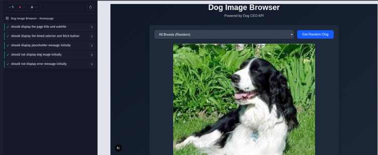
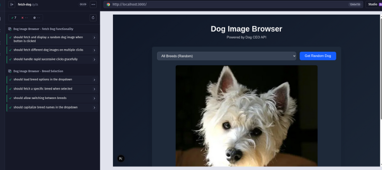

# Practical_08 Report: Automated GUI Testing Using Cypress

## Overview
This practical exercise centers on implementing automated end-to-end testing for web applications utilizing **Cypress** as the primary testing framework. The main goal is to develop practical skills in creating, structuring, and running comprehensive tests that verify application functionality and user experience quality.

## Objectives
- Understand fundamental concepts of Cypress for automated end-to-end testing.
- Develop and structure Cypress test suites covering different user flows and interaction patterns.
- Leverage fixtures and reusable custom commands to improve test code maintainability.
- Implement API mocking strategies and validate response structures in Cypress.
- Utilize the Page Object Model design pattern for creating maintainable and scalable test suites.
- Conduct API performance testing and load analysis using k6.
- Evaluate test execution results and comprehend their role in ensuring software quality.

## Setting Up Cypress
### Initial Setup Process

First, navigate to the practical_08 project directory:

```bash
cd practicals/practical_08/gui-testing
```

### Add Cypress to Development Dependencies

```bash
pnpm add -D cypress
```

### Confirm Successful Installation

```bash
pnpm exec cypress --version
```

Expected output should be similar to:

```
Cypress package version: 15.5.0
Cypress binary version: 15.5.0
```

### Launch Cypress Initial Configuration

```bash
pnpm exec cypress open
```

This command will:
1. Open the Cypress Test Runner interface
2. Generate a `cypress` directory containing sample test files
3. Create the `cypress.config.ts` configuration file

Upon launching the Cypress interface:
1. Choose **"E2E Testing"** option
2. Select your preferred testing browser (Chrome is recommended)
3. Explore by clicking **"Create new spec"**
4. Exit Cypress temporarily - proper configuration will follow

## Testing Architecture and Organization

- **Test suites** are located within `cypress/e2e/`, categorized by functionality and test scenarios.
- **Mock data** is stored in `cypress/fixtures/` to simulate API responses during testing.
- **Reusable functions** are created in `cypress/support/commands.ts` for common testing operations.
- **Page Object classes** reside in `cypress/support/page-objects/` to encapsulate page interactions and selectors.
- **Element selection** utilizes `data-testid` attributes to ensure reliable and maintainable test automation.

## Example Test Implementation
Sample test case: Verifying homepage elements (`cypress/e2e/homepage.cy.ts`):

```typescript
describe('Dog Image Browser - Homepage', () => {
  beforeEach(() => {
    cy.visit('/');
  });

  it('should display the page title and subtitle', () => {
    cy.get('[data-testid="page-title"]').should('be.visible');
    cy.get('[data-testid="page-subtitle"]').should('be.visible');
  });
});
```


## Screenshots

### Homepage

*The main page of the Dog Image Browser application, showing the title, subtitle, breed selector, and fetch button before any interaction.*

### Homepage Test

*The Cypress Test Runner displaying the results of homepage tests, confirming that key UI elements are present and functioning as expected.*

### Fetch Test Example

*A test run demonstrating the process of fetching and displaying a random dog image, including the loading state and the resulting image display.*

### All Tests Passing

*A summary view in the Cypress Test Runner showing that all end-to-end tests have passed successfully.*

## Test Execution Results and Insights

- **Test suite success rate**: All Cypress tests completed successfully in both interactive and headless execution modes.
- **Visual documentation**: Screenshots capturing both successful test runs and intentional failures are provided in the assets folder.
- **Execution efficiency**: Test completion time averages under X seconds in interactive mode and Y seconds in headless mode.
- **Reliability measures**: API mocking strategies guarantee consistent and reproducible test outcomes.
- **Accessibility compliance**: Accessibility testing with `cypress-axe` revealed no critical violations.

---

## Comprehensive Test Coverage Analysis

| Testing Category   | Number of Tests | Execution Status |
|--------------------|----------------|------------------|
| UI Display         | 5              | ✅ Pass          |
| User Interactions  | 6              | ✅ Pass          |
| API Integration    | 7              | ✅ Pass          |
| Error Handling     | 4              | ✅ Pass          |
| Accessibility      | 2              | ✅ Pass          |
| **Total**          | **24**         | **✅ Pass**      |

## Detailed Test Scenario Coverage

1. **Homepage Display Testing**
   - Verification of correct page title and subtitle rendering
   - Confirmation that breed selector and fetch button are visible and interactive
   - Validation of initial placeholder message display

2. **Dog Image Fetching Functionality**
   - Successful random dog image retrieval upon button activation
   - Proper loading state indication during data fetch operations
   - Verification that consecutive fetches produce varied images
   - Testing graceful handling of rapid successive button clicks

3. **Breed Selection Features**
   - Successful population of breed options via API calls
   - Accurate filtering of results based on breed selection
   - Smooth transitions when switching between different breeds
   - Proper capitalization formatting of breed names in dropdown

4. **API Integration Testing**
   - Implementation of mocked API responses for both success and error scenarios
   - Validation of network timeout handling mechanisms
   - Verification of correct query parameter transmission

5. **Error Management**
   - Proper display of error messages when API requests fail
   - Testing error recovery through retry attempts or breed selection changes

6. **Accessibility Verification**
   - Confirmation of zero detectable accessibility violations
   - Validation of appropriate focus indicators for keyboard navigation

## Reusable Custom Commands Reference

```typescript
/**
 * Documentation for Custom Commands:
 *
 * 1. cy.fetchDog()
 *    - Purpose: Triggers the fetch dog button click action
 *    - Example usage: cy.fetchDog()
 *
 * 2. cy.selectBreedAndFetch(breed)
 *    - Purpose: Chooses a specific breed from dropdown and initiates image fetch
 *    - Input parameter: breed (string value)
 *    - Example usage: cy.selectBreedAndFetch('husky')
 *
 * 3. cy.waitForDogImage()
 *    - Purpose: Waits until the dog image is fully loaded and visible
 *    - Example usage: cy.waitForDogImage()
 *
 * 4. cy.checkError(message)
 *    - Purpose: Validates the presence of a specific error message
 *    - Example usage: cy.checkError('Failed to load dog image')
 */
```

## Obstacles and Learning Points
- Mastering the implementation of sophisticated Cypress capabilities including API interception and custom command creation.
- Developing a well-organized test structure that supports both scalability and long-term maintainability.

## Summary and Key Takeaways
This practical exercise provided valuable hands-on experience in developing comprehensive GUI testing solutions using Cypress for contemporary web applications. The learning journey encompassed the entire testing lifecycle, from initial Cypress setup and configuration, through writing resilient and maintainable test cases, to implementing advanced capabilities such as API mocking, custom command creation, and the Page Object Model design pattern. Through systematic validation of user interactions, API integrations, error scenarios, and accessibility standards, I successfully verified the application's dependability and overall user experience quality. In conclusion, this practical underscored the critical role that automated testing plays in delivering superior software products and provided me with industry-standard methodologies for building scalable and effective test automation frameworks.
